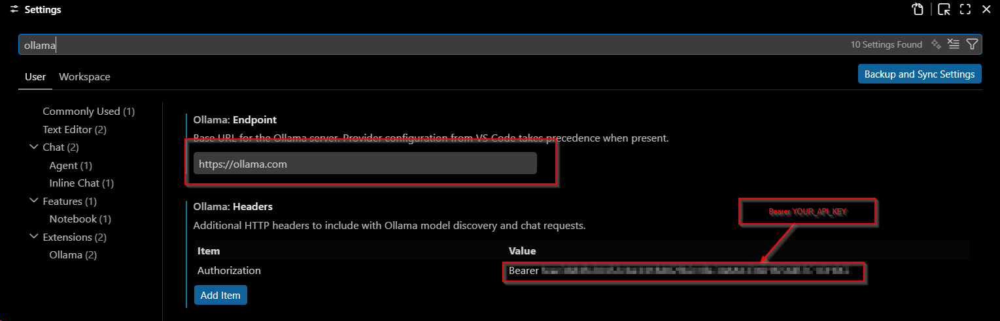

# ollama-scripts


Point coding CLIs at [ollama.com](https://ollama.com)'s cloud models using one `OLLAMA_API_KEY`. No `ollama launch`, no sign-in.

It is however recommended that you have the tool `curl -fsSL https://ollama.com/install.sh | sh` installed so you can take advantage of local models.

## Setup

```sh
export OLLAMA_API_KEY=...   # your ollama.com key (put in shell rc)
# set -gx OLLA...           # if you're on fish
mise install                # fetch gum (model chooser)
mise run check              # verify key + API reachable
mise run install            # symlink launchers into ~/.local/bin
```

`mise run uninstall` removes the symlinks. No mise? `brew install gum` and
`ln -s "$PWD"/ollama-{claude,codex,pi,oh-my-cli,codex-app,claude-app,gui} ~/.local/bin/`.

## Launchers

| Command | Harness | Endpoint |
|---|---|---|
| `ollama-claude` | Claude Code | Anthropic `/v1/messages` (Bearer) |
| `ollama-codex` | Codex CLI | OpenAI `/v1/responses` |
| `ollama-pi` | pi | OpenAI `/v1/chat/completions` |
| `ollama-oh-my-cli` | oh-my-cli | OpenAI `/v1/responses` |

Pick a model three ways (first wins): `--model NAME`, `OLLAMA_MODEL=NAME`, or the
`gum` chooser (prefilled with your last pick, remembered per-harness in
`~/.config/ollama-scripts/`). Everything else is passed through:

```sh
ollama-codex --model qwen3-coder:480b exec "fix the failing test"
ollama-claude                       # chooser, then normal claude session
```

## Desktop apps

Same idea for the GUIs, mirroring `ollama launch` but keyed straight to
ollama.com — no sign-in. **macOS only.**

Unlike the CLIs, desktop apps can't read the shell env, so these must **write
config files** — persistent, not ephemeral. Every touched file is copied to
`<file>.ollama-scripts.bak` first, and `ollama-unset.sh` reverts everything.

| Command | App | How |
|---|---|---|
| `ollama-codex-app` | Codex desktop | writes `~/.codex/config.toml` provider (backed up), then restarts Codex |
| `ollama-claude-app` | Claude Desktop | writes Claude's 3p gateway profile (backed up), then relaunches |
| `ollama-gui` | Ollama app | launches `Ollama.app` with `OLLAMA_API_KEY` in its env |

```sh
ollama-codex-app --model glm-5.2        # picks a model like the CLIs
ollama-claude-app                       # switch Claude Desktop to Ollama Cloud
ollama-gui                              # open the Ollama app with cloud access
```

Because the Codex launchers write a model catalogue covering **all** your ollama
cloud models, you can switch mid-session with `/model` inside Codex instead of
restarting the harness. Launching still picks one default (`--model`, `OLLAMA_MODEL`,
or the chooser), but the picker lists everything.

### Undo

`ollama-unset.sh` returns Codex, Claude Desktop, and pi to their original
providers — restoring each config from its `.ollama-scripts.bak` (or stripping
only what was added if no backup exists) and quitting the apps so they reload
clean. The CLI wrappers (`ollama-claude`, `ollama-codex`) need no undo; they only
set env for their own subprocess.

```sh
ollama-unset.sh                         # revert all app/pi config changes
```

Per-app reverts also exist: `ollama-codex-app --restore`, `ollama-claude-app --restore`.

## VS Code

The [Ollama VS Code extension](https://marketplace.visualstudio.com/items?itemName=Ollama.ollama)
supports cloud models natively — no launcher script needed. Install the
extension, then set two options in VS Code settings (`Cmd+,`):

- `ollama.endpoint` → `https://ollama.com`
- `ollama.headers` → add an `Authorization` header with value `Bearer <your-key>`



Open the model picker in VS Code Chat (`Cmd+Shift+M`) and your cloud models
appear under the **Ollama** section.

## Adding your harness

Each launcher is ~10 lines. Copy one, then:

1. **Source the lib** and require the key:
   ```sh
   source "$(dirname "$(readlink -f "$0")")/lib.sh"
   _require_key
   ```
1. **Resolve the model** — parses `--model`, else chooser/`OLLAMA_MODEL`:
   ```sh
   _resolve_model <harness-name> "$@"   # sets $MODEL and array $REST (leftover args)
   ```
   `<harness-name>` is just the key for the last-used file.
1. **Wire the endpoint** to `https://ollama.com` using `$OLLAMA_API_KEY`, then
   `exec` the tool with `$MODEL` and the passthrough args:
   ```sh
   exec yourtool --model "$MODEL" "${REST[@]+"${REST[@]}"}"
   ```
